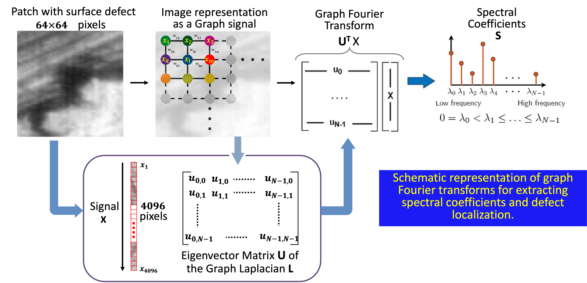
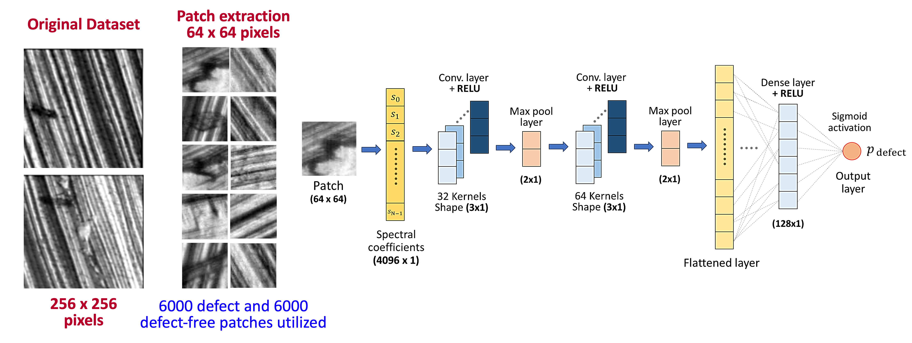
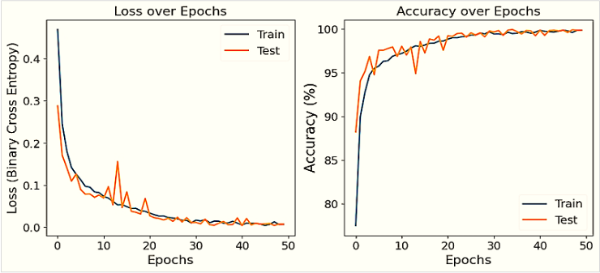
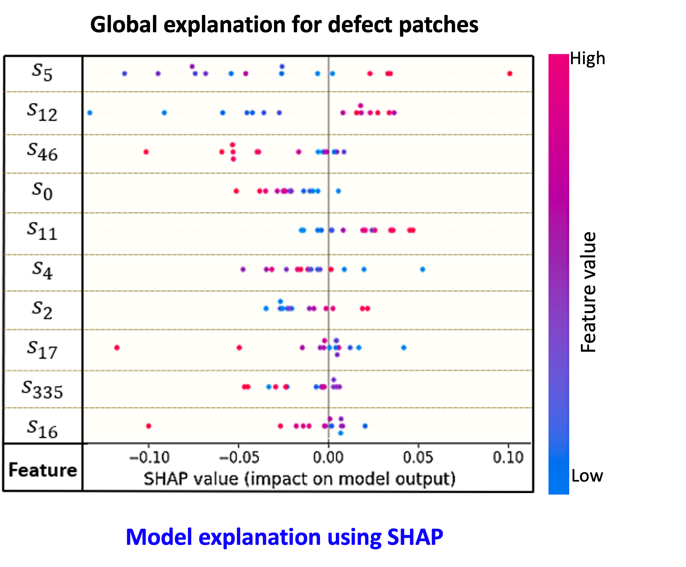
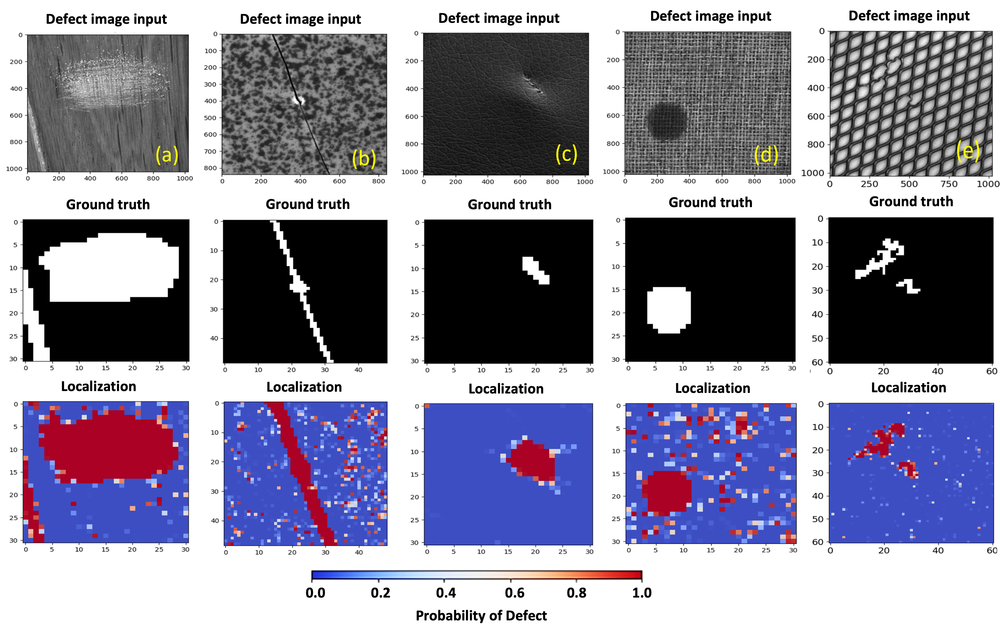

# Learning Graph-Fourier Spectra of Textured Surface Images for Defect Localization

[](https://opensource.org/licenses/MIT)

## Abstract

This project addresses the challenge of detecting defects in images with highly textured backgrounds, common in industrial manufacturing. By leveraging graph Fourier analysis (Sandryhaila & Moura, 2014), the approach identifies defective images and crucial graph Fourier coefficients that highlight defects. Our 1D-CNN architecture achieves 99.4% classification accuracy with SHAP values (Lundberg & Lee, 2017) providing interpretable insights into spectral coefficient importance.

## Installation

1. Clone the repository:
   ```bash
   git clone https://github.com/yourusername/graph-fourier-defect-detection.git
   cd graph-fourier-defect-detection
   ```

2. Install requirements:
   ```bash
   pip install -r requirements.txt
   ```

## Dataset

The MVTec AD dataset (Bergmann et al., 2019) is used for evaluation. To download:
1. Visit [MVTec AD dataset portal](https://www.mvtec.com/company/research/datasets/mvtec-ad)
2. Complete the academic license agreement
3. Use provided download scripts

Preprocess with `dataset_creation.ipynb` to generate patched datasets.

## Methodology

### Feature Extraction
  
*Graph Fourier Transform pipeline (Sandryhaila & Moura, 2014) for texture representation*

### Classification Pipeline
1. Graph construction from texture patches
2. Spectral coefficient computation via GFT
3. 1D-CNN classification (Kiranyaz et al., 2021)
4. SHAP-based model interpretation

  
*End-to-end defect detection workflow*

## Results

### Classification Performance

| Class       | Mean Pixel-wise AUROC (%) |
|-------------|--------------------------:|
| **Wood**    |                     90.79 |
| **Tile**    |                     93.50 |
| **Leather** |                     98.40 |
| **Carpet**  |                     93.20 |
| **Grid**    |                     93.20 |

  
*Convergence plot showing 99.94% training accuracy and 99.91% validation accuracy over 50 epochs*

### Model Interpretation
  
*SHAP values identifying critical low-frequency components (Lundberg & Lee, 2017)*

### Benchmark Comparison
  
*State-of-the-art comparison on MVTec AD (Bergmann et al., 2019)*

## Citation

If you use this work in your research, please cite:

```bibtex
@article{nakkina2024learning,
  title={Learning graph-Fourier spectra of textured surface images for defect localization},
  author={Nakkina, Tapan Ganatma and Karthikeyan, Adithyaa and Eksin, Ceyhun and Bukkapatnam, Satish TS},
  journal={Manufacturing Letters},
  volume={41},
  pages={1568--1578},
  year={2024},
  publisher={Elsevier}
}
```

## References
- Bergmann, P., et al. (2019). MVTec AD -- A Comprehensive Real-World Dataset for Unsupervised Anomaly Detection. CVPR.
- Kiranyaz, S., et al. (2021). 1D Convolutional Neural Networks for Signal Processing Applications. IEEE TII.
- Lundberg, S. M., & Lee, S.-I. (2017). A Unified Approach to Interpreting Model Predictions. NeurIPS.
- Nakkina, T. G., et al. (2024). Learning graph-Fourier spectra of textured surface images for defect localization. Manufacturing Letters, 41, 1568-1578.
- Sandryhaila, A., & Moura, J. M. (2014). Discrete Signal Processing on Graphs. IEEE TSP.

## Contributing

This project adheres to the [Contributor Covenant](https://www.contributor-covenant.org/). Please see [CONTRIBUTING.md](CONTRIBUTING.md) for details.

## License

MIT License - See [LICENSE](LICENSE) for full text. 